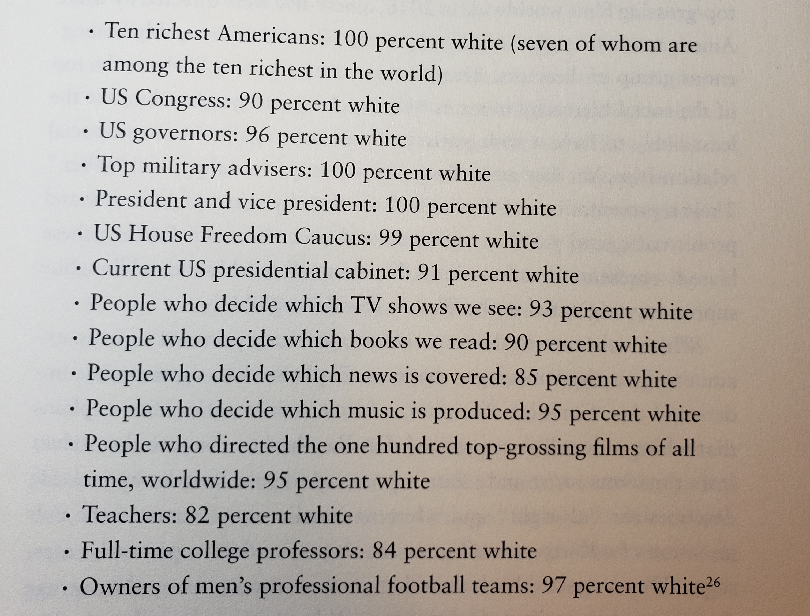
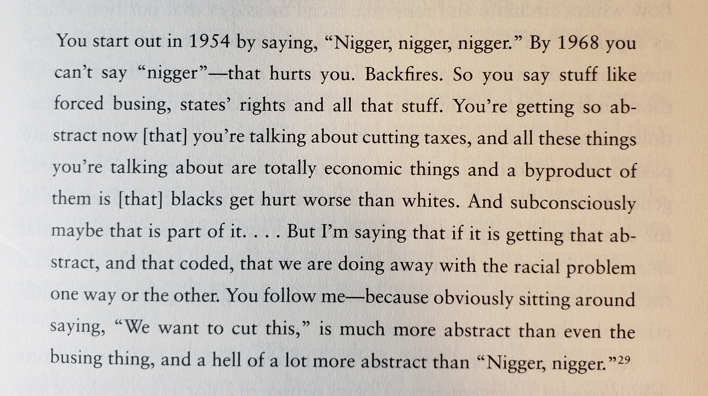
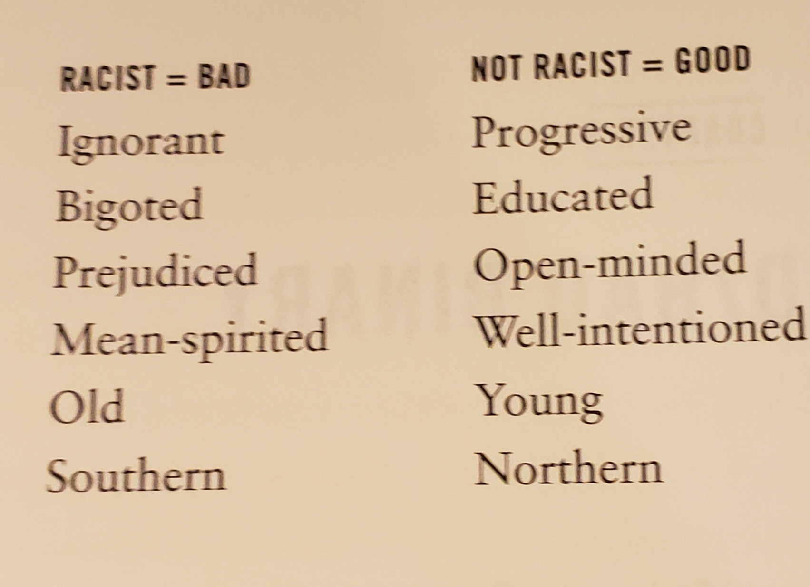
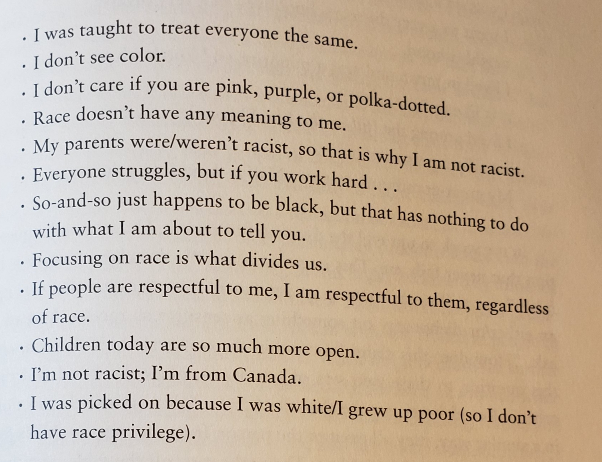
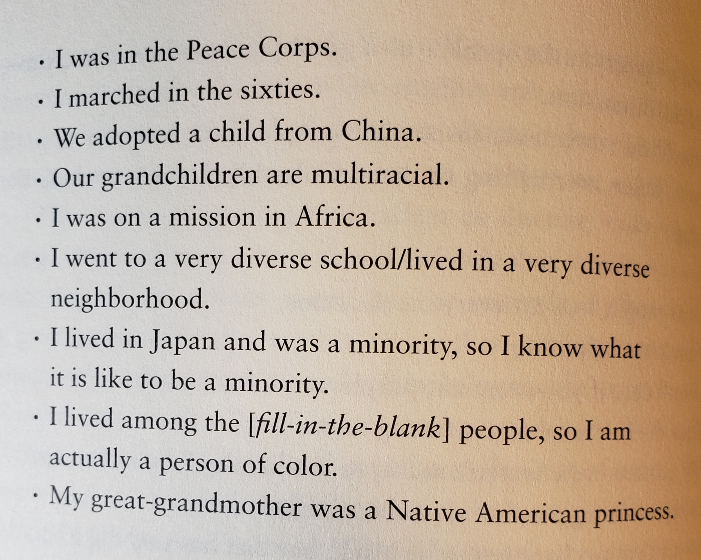
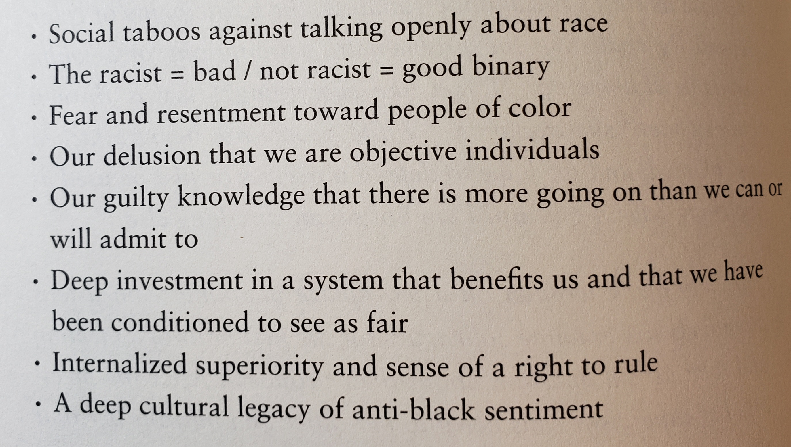
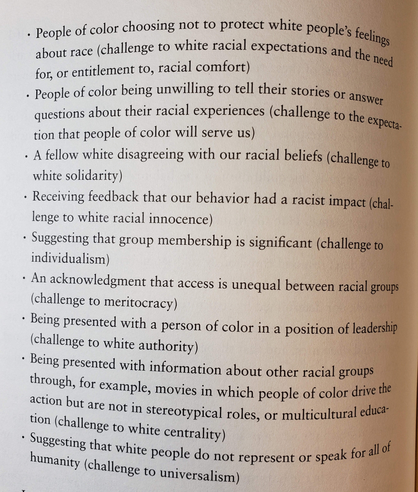
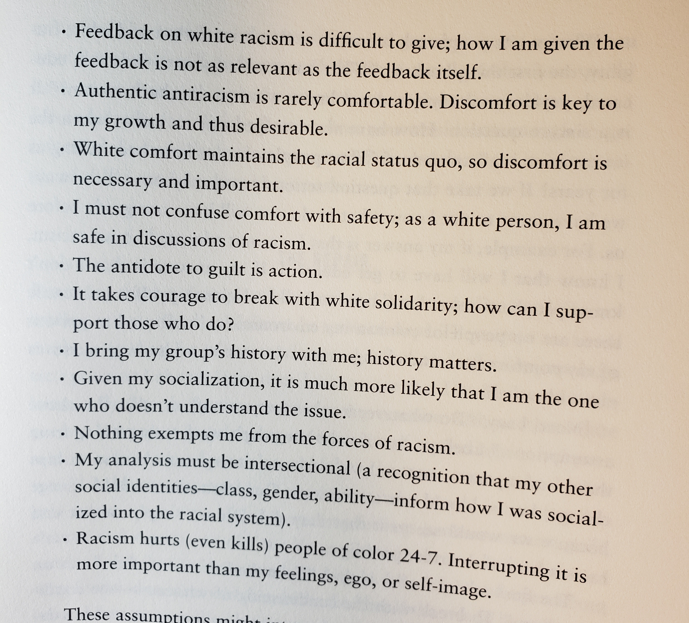
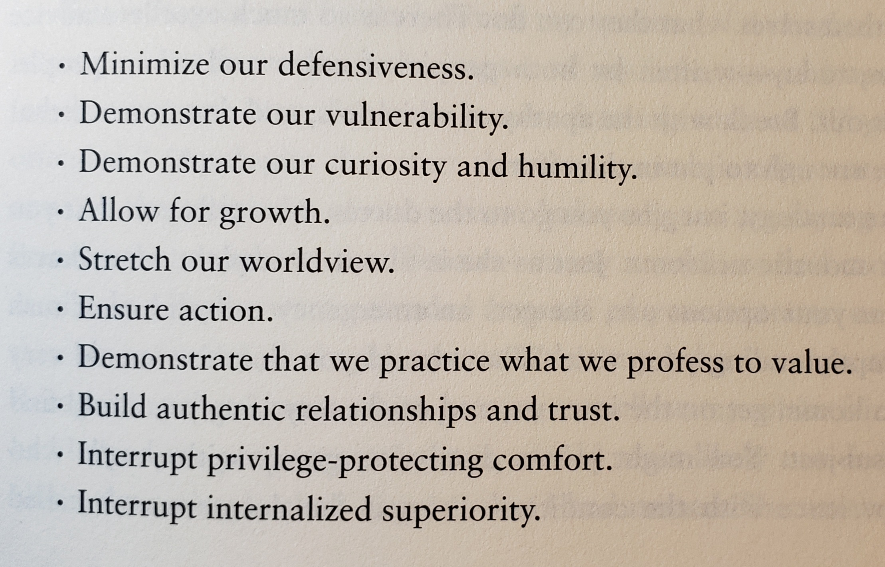

## TL;DR

"White Fragility" by Robin DeAngelo is a great book about racism.  You
should read it.  This blog post tries to get you to read it by
extracting what I think are the best parts.  That's why it's so long.

## Details

The best indicator that a white person really needs to read "White
Fragility" by Robin DiAngelo (Beacon Press, 2018) is their first
response to the mere suggestion that they read it. This speaks to two
things: 1. a great title 2. the absolute necessity for more white people
to read the book. I have only suggested it to a few people, but
reactions range from indignation to scorn. One person told me they
thought I was "too smart to read a book like that".  I hope this brief
moment of national awareness prompted by the murder of George Floyd by
an agent of the state might give such people a reason to read this blog
post, and then hopefully Ms. Diangelo's highly accessible 154 page book.
This blog post is my selection of highlights from the book, with
occasional thoughts mixed in.

Ms. DiAngelo has done many years of trainings and workshops about racism
to mostly white audiences.  If you work in corporate America, you
probably have been exposed to this kind of training.  You may even
resent having had to take it.  In my case it was web-delivered training
that really can't offer the kind of growth an in-person class can offer.
If you had in-person training, this book may resonate even more with
you.  The in-person training done by Ms. DiAngelo and her company
produces real interactions and reactions from the participants.  These
reactions and related observations are the research corpus for this
book.  When Ms. DiAngelo says, "this is how white people respond when I
say X," I trust her credibility.  I'm asking you to do the same, at
least while reading this blog post, and, hopefully, reading the book.

I'll take a really nice hook from the end of the book and try to set it
here:

```

Imagine you go to the doctor, who tells you that you have an acoustic
neuroma.  Just as she is about to explain what this is and what your
options are, she gets an emergency call and must rush off, abruptly
ending your visit.  What would you do?  You would very likely go home,
get on the internet, and read everything you could find on the
subject...Bottom line: you would care enough to get informed.  So
consider racism a matter of life and death (as it is for people of
color), and do your homework.

```

Reading this blog post is a great start.  Reading the book would be a
great next step.

Ms. DiAngelo starts out by showing the scope of the problem, and how
completely intractable it is, but somehow manages to make me able to
keep reading.  The hook is how she does it: not through some sugar
coated sense of hope, but through honesty and candor.  As I read the
book I get the sense: yes, I can do this.

## Author's Note

Ms. DiAngelo commences with an Author's Note which sets the tone
with these facts:

```

The United States was founded on the principle that all people are
created equal.  Yet the nation began with the attempted genocide of
Indigenous people and the theft of their land.  American wealth was
built on the labor of kidnapped and enslaved Africans and their
descendants.

```

If you dispute these facts, or even the existence of facts themselves, then
any discussion about the content of this book or any other book is
futile unless the differences between your worldview and mine are taken
into account.  This article from the peer-reviewed journal "Systems" in
2018 is a good place to start:
[A Systematic Framework for Exploring Worldviews and Its Generalization as a Multi-Purpose Inquiry Framework](https://doi.org/10.3390/systems6030027).
My epistemological worldview disclosure: I believe the scientific method
can progressively reveal the truth about all real phenomena.

```

While implicit bias is always at play because all humans have bias,
inequity can occur simply through homogeneity; if I am not aware of the
barriers you face, then I won't see them, much less be motivated to
remove them.  Nor will I be motivated to remove the barriers if they
provide an advantage to which I feel entitled.


```

This is the most succinct business case for a diverse workforce I have
personally ever seen.

## Chapter 1: The Challenges of Talking to White People About Racism

White people need to be comfortable being seen as white. Racially.

```

In fact, when we try to talk openly and honestly about race, white
fragility quickly emerges as we are so often met with silence,
defensiveness, argumentation, certitude, and other forms of pushback.
These are not natural responses; they are social forces that prevent us
from attaining the racial knowledge we need to engage more productively,
and they function powerfully to hold the racial hierarchy in place.

```

Basically, if you react in any of the above ways when talking about
whiteness, and what it means to be white, or blackness and what it means
to be black, you are showing white fragility.  Another term she uses is
"racial stamina".  This is the ability to **not** react that way.  In my
opinion, the use of the term "stamina" is a nod to how even the most
racially aware white person must always exert effort to not react with
white fragility because of how thoroughly the social construct of race
is unavoidably encoded in civilizations thus far, including the one in
which I was raised and continue to live.

She calls out two key western ideologies which hinder white people's
understanding of race.  I had trouble understanding this.  I probably
won't capture it well, so read the book.

### Individualism

```

Individualism is a story line that creates, communicates, reproduces,
and reinforces the concept that each of us is a unique individual and
that our group memberships, such as race, class, or gender, are
irrelevant to our opportunities.  Individualism claims that there are no
intrinsic barriers to individual success and that failure is not a
consequence of social structures but comes from individual
character...On some level, we know that Bill Gates's son was born into a
set of opportunities that will benefit him throughout his life, whether
he is mediocre or exceptional.  Yet even though Gates's son has clearly
been handed unearned advantage, we cling tightly to the ideology of
individualism when asked to consider our own unearned advantages.

```
The cardinal rule of individualism is: don't generalize, yet:

```
As a sociologist, I am quite comfortable generalizing; social life is
patterned and predictable in measurable ways.  But I understand my
generalizations may cause some defensiveness for the white people about
whom I am generalizing, given how cherished the ideology of
individualism is in our culture.

```

Basically, if you think you're special, you're really not.  You are
completely formed by the system you grew up in and continue to live
in. Y'all ain't that special.

### Objectivity

(Aside: The Objectivity of Subjectivity scene from
[Love and Death](https://www.youtube.com/watch?v=X5cQcmAtjJ0) covers
objectivity also.  Yes, Woody Allen is implicated in #MeToo, but
Diane Keaton is
[quoted here](https://www.refinery29.com/en-us/2018/09/210100/woody-allen-me-too-timeline#slide-4)
supporting him.   It's still a funny movie.)

Because individualism is a lie, you really can't be objective, because
everything you observe is from your group perspective.  Stick with me
here


```

Rather than use what you see as unique about yourself as an exemption
from further examination, a more fruitful approach would be to ask
yourself, "I am white and I have had X experience.  How did X shape me
as a result of *also being white?*"  Setting aside your uniqueness is
a critical skill that will allow you to see the big picture of the
society in which we live; individualism will not.

```

#### We Have a Simplistic Understanding of Racism

Now she gets to the problem with how white people define racism.  If you
take one thing away from this blog post, it's this.

```

The final challenge we need to address is our definition of "racist."
In the post-civil rights era, we have been taught that racists are mean
people who intentionally dislike others because of their race; racists
are immoral.  Therefore, if I am saying that my readers are racist or,
even worse, that all white people are racist, I am saying something
deeply offensive; I am questioning my readers' very moral character.
How can I make this claim when I don't even know my readers?  Many of
you have friends and loved ones of color, so how can you be racist?  In
fact, since it's racist to generalize about people according to race, I
am the one being racist!  So let me be clear: If your definition of a
racist is someone who holds conscious dislike of people because of race,
then I agree that it is offensive for me to suggest that you are racist
when I don't know you.  I also agree that if this is your definition of
racism, and you are against racism, then you are not racist....I am not
using this definition of racism, and I am not saying you are immoral.
If you can remain open as I lay out my argument, it should soon begin to
make sense.

In light of the challenges raised here, I expect that white readers will
have moments of discomfort reading this book.  This feeling may be a
sign that I've managed to unsettle the racial status quo, which is my
goal.  The racial status quo is comfortable for white people, and we
will not move forward in race relations if we remain comfortable.  The
key to moving forward is what we do with our discomfort.  We can use it
as a door out -- blame the messenger and disregard the message.  Or we
can use it as a door in by asking, Why does this unsettle me?  What
would it mean for me if this were true?

```

## Chapter 2: Racism and White Supremacy

The the importance of being seen as white.

```

[the American ideal is] once new immigrants learn English and adapt to American culture and
customs, they become Americans.  In reality, only European immigrants
were allowed to melt, or assimilate into dominant culture in the
nineteenth and twentieth centuries, because...these immigrants were
perceived to be white and thus could belong.

```

Race and class

```

The poor and working classes, if united across race, could be a powerful
force.  But racial divisions have served to keep them from organizing
against the owning class who profits from their labor.

```

### Racism

To understand racism, distinguish it from prejudice and discrimination.
Prejudice: all humans have it.  It is unavoidable.  It is part of
cognition, so it is a mistake to call it bad.

Discrimination is action based on prejudice.  Emphasis mine.  But here's
the first occurrence of a succinct definition in the book.

```

Prejudice always manifests itself in action because the way I see the
world drives my actions in the world.  Everyone has prejudice, and
everyone discriminates.  Given this reality, inserting the qualifier
"reverse" is nonsensical.

When a racial group's collective prejudice is backed by the power of
legal authority and institutional control, it is transformed into
racism, **a far-reaching system that functions independently from the
intentions or self-images of individual actors.**

...


People of color may also hold prejudices and discriminate against white
people, but they lack the social and institutional power that transforms
their prejudice and discrimination into racism; the impact of their
prejudice on whites is temporary and contextual.  Whites hold the social
and institutional positions in society to infuse their racial prejudice
into the laws, policies, practices, and norms of society in a way that
people of color do not.  A person of color may refuse to wait on me if I
enter a shop, but people of color cannot pass legislation that prohibits
me and everyone like me from buying a home in a certain neighborhood.

```

That said, I can finally summarize her definition of being a racist: **a
racist is someone who has been shaped by a racist system.**  You can see
a video with Ms. DiAngelo at
[tolerance.org](https://www.tolerance.org/magazine/summer-2019/whats-my-complicity-talking-white-fragility-with-robin-diangelo).
At 21:38 in that video she gives that definition.

I accept this definition, and I acknowledge that by this definition I am
a racist.  Let me illustrate with a concrete personal example.  Richard
Rothstein's 2017 book *The Color of Law* examines the racial aspects of
federal lending and housing policies (including those of the Trump
family).  The house I grew up in was financed by a mortgage whose rate
was not accessible unless you were white.  So, in addition to all the
other ways in which I have been shaped by a racist system, this one very
concrete way is quantifiable and indisputable.  If you want learn more
about the housing aspects of racism, listen to this
[interview with Richard Rothstein](https://www.npr.org/2017/05/03/526655831/a-forgotten-history-of-how-the-u-s-government-segregated-america).
I like focusing on this aspect because it is factually defensible
(again, my epistemological worldview showing up).

```

Racism is a society-wide dynamic that occurs at the group level.  When I
say that only whites can be racist, I mean that in the United States,
only whites have the collective social and institutional power and
privilege over people of color.  People of color do not have this power
and privilege over white people.

```

### Whiteness as a Position of Status

```

Whiteness rests upon a foundational premise: the definition of whites as
the norm or standard for human, and people of color as a deviation from
that norm.  Whiteness is not acknowledged by white people, and the white
reference point is assumed to be universal and is imposed on everyone.

```

### White Supremacy

```

Race scholars use the term *white supremacy* to describe a
sociopolitical economic system of domination based on racial categories
that benefits those defined and perceived as white.  This system of
structural power privileges, centralizes, and elevates white people as a
group.  If, for example, we look at the racial breakdown of the people
who control our institutions, we see telling numbers in 2016-2017:

```



Who doesn't like trying to get to the root cause of problems?  I've long
fingered Republican strategist Lee Atwater as at least close to the root
cause for a lot of the problems I see.  Ms. DiAngelo does as well.

```

In a 1981 interview, Lee Atwater, Republican political strategist and
adviser to presidents Ronald Reagan and George H. W. Bush, explained
what came to be known as "the Southern strategy" -- how to appeal to the
racism of white Southern voters without pronouncing it openly:

```



Mr. Atwater is explaining more than the Southern strategy.  He is explaining the birth of the
good/bad binary.  This sociolinguistic construct is what has enabled recisim to continue to
thrive and grow since the civil rights era.

## Chapter 5 The Good/Bad Binary

```

This chapter explores what is perhaps the most effective adaptation of
racism in recent history: the good/bad binary.  Prior to the civil
rights movement, it was socially acceptable for white people to openly
proclaim their belief in their racial superiority.  But when white
Northerners saw the violence black people--including women and
children--endured during the civil rights protests, they were appalled.

```

Aside: The reason they saw this, and were appalled was broadcast TV.  Not
cable TV.  Not hyper-personalized Internet TV.  Broadcast TV.  Curated
and, yes, censored by the FCC.  But it was still very much seen as "the
people's airwaves".  The media during the civil rights era was not nearly so
effectively monetized as it is now.  If we had today's media landscape
during the civil rights era, none of the civil rights era would have
happened.  The people that were "appalled" as Ms. DiAngelo says above
wouldn't have even seen the content because networks like Fox News would
not be able to air it for fear of alienating their audience, and thus,
their sponsors.  As it happened many of those Northerners got on busses
and joined in the marches, and took the punches, and ended up in jail as
well.

If you are interested in how the media got so messed up as it is today,
where it is seen as an "enemy of the people" by many Americans, please
study
[Edward R. Murrow's speech](https://www.pbs.org/wnet/americanmasters/education/lesson39_organizer1.html)
from the 1958 Radio-Television News Directors Association conference on
1958-10-15.  Of course, the media are not the enemy of the people, but
because they are so effectively monetized by playing on the very worst
of human nature, it is very easy to find examples that justify that
fascist analysis of the (still) free press.

Anyhow, back to the 60s.

```

...In other words, racists were mean, ignorant, old, uneducated, Southern
whites.  Nice people, well-intended, open-minded, middle-class people,
people raised in the "enlightened North," could not be racist.


```



```

...The good/bad binary made it effectively impossible for the average
white person to understand--much lest interrupt--racism.

...The good/bad frame is a false dichotomy.  All people hold prejudices,
especially across racial lines in a society deeply divided by race.  I
can be told that everyone is equal by my parents, I can havefriends of
color, and I may not tell racist jokes.  Yet I am still affected by the
forces of racism as a member of a society in which racism is the
bedrock.  I will still be seen as white, treated as white, and
experience life as a white person.

...if, as a white person, I conceptualize racism as a binary and I place
myself on the "not racist" side, what further action is required of me?
No action is required because I am not a racist.  Therefore racism is
not my problem; it doesn't concern me and there is nothing further I
need to do.  This worldview guarantees that I will not build my skills
in thinking critically about racism or use my position to challenge
racial inequality.

```

Yep.  I was that way until I read this book.  I guess that means I'm
woke?  But, really, I'm still that way.  But now I know that I need to
constantly try to interrupt racism whenever I can.

The good/bad binary protects the racial status quo.  Ms. DiAngelo offers
some statements that flow from the good/bad binary.

```

Color-blind statements insist that people do not see race, or if they see
it, it has no meaning to them.  Color-blind claims include the following:

```



```

The second I term *color-celebrate*.  This set claims that the person
sees and embraces racial differences.  Color-celebrate claims include
statements such as these:

```




Ms. DiAngelo states that she's heard all of these claims in her work at
teaching tolerance.  I believe her.  I've heard them myself, and if I interrupt racism, 
I'll hear them a lot more.

```

The question is *not* is "Is this claim true, or is it false?"; we will
never come to an agreement on a question that sets up an either/or
dichotomy on something as sensitive as racism.  Instead I ask, "How does
this claim function in the conversation?"...[color-blind and color-celebrate claims]
all exempt the person
from any responsibility for or participation in the problem.  They take
race off the table, and the close (rather than open) any further
exploration.

```

## Chapter 6 Anti-Blackness

I want to highlight Ms. DiAngelo's treatment of affirmative action.
Rage against affirmative action is so closely entwined with
Republicanism (I won't say conservatism because conservatism is about as precise a term as antifa at
this point) that I smiled when I saw this important topic was about to
get the DiAngelo treatment.

```

There is a great amount of misinformation about affirmative action, as
evidenced in the idea of special rights.  For example, people commonly
believe that if a person of color applies for a position, he or she must
be hired over a white person; that black people are given preferential
treatment in hiring; and that a specific number of people must be hired
to fill a quota.  All these beliefs are patently untrue.  Affirmative
action is a tool to ensure that *qualified* minority applicants are
given the same employment opportunities as while people.  It is a
flexible program --there are no quotas or requirements as commonly
understood...No employer is required to hire an unqualified person of
color, but companies are required to be able to articulate why they
didn't hire a qualified person of color...

Still, this program has been systematically chipped away at, and several
states have eliminated affirmative action programs altogether.

```

## Chapter 7 Racial Triggers for White People

And you thought only liberal snowflake SJWs could be
"[triggered](https://en.wikipedia.org/wiki/Rolling_coal)"?  Turns out
no!

```

When ideologies such as color blindness, meritocracy, and individualism
are challenged, intense emotional reactions are common.  I have
discussed several reasons why whites are so defensive about the
suggestion that we benefit from, and are complicit in, a racist system:

```



Now she finally answers the question, "what can we do about it?".
She calls it interrupting racism (FWIW, I prefer racism interrupted).

```

These interruptions can take a variety of forms and come from a range of
sources, including:

```




```

When disequilibrium occurs--when there is an interruption to that which
is familiar and taken for granted--white fragility restores equilibrium
and returns the capital "lost" via the challenge...Again these
strategies are reflexive and seldom conscious, but that does not make
them benign

```

I get the sense here that this strategy of interruption can be used in
other contexts than racism.  There's probably a playbook somewhere of
how to abuse this strategy to manipulate someone.  Perhaps this is
something master gas-lighters instinctively know how to do.

## Chapter 8 The Result: White Fragility

```

If we become adults who explicitly oppose racism, as do many, we often
organize our identity around a denial of our racially based privileges
that reinforce racist disadvantage for others.  What is particularly
problematic about this contradiction is that white people's moral
objection to racism increases their resistance to acknowledging their
complicity with it.

...

Let me be clear: while the capacity for white people to sustain
challenges to our racial positions is limited--and, in this way,
fragile--the effects of our responses are not fragile at all; they are
quite powerful and because they take advantage of historical and
institutional power and control.

```

## Chapter 9 White Fragility in Action

In this chapter, Ms. DiAngelo recounts stories from her work teaching
corporate tolerance classes and shows how the concepts explained in the
preceding chapters play out.  The feelings, claims, triggers,
assumptions, and interruptions can be seen in action.

## Chapter 12 Where Do We Go From Here?

By this point, the reader should know:

* The good/bad binary enables a definition of racism that actually
  allows racism to continue unchallenged (evil brilliance, isn't it?).

* A more helpful (and Christ-like) definition is.

   When a racial group's collective prejudice is backed by the power of
   legal authority and institutional control, it is transformed into
   racism, **a far-reaching system that functions independently from the
   intentions or self-images of individual actors.**

* White fragility is what happens when white people who use the
  good/bad binary definition of racism are challenged to change their
  definition to the more helpful definition.

At long last, chapter 12 gave me hope by really showing me, "hey, I can
do this" and "hey, this is really worth doing."  I hope you end up with
the same feeling.

```

However, from a transformed paradigm, when we are given feedback on our
inevitable but unaware racist patterns, we might have very different
feelings:

```


```

When we have these feelings, we might want to engage in the following
behaviors:

```


```

What claims might we make when we have these feelings and engage in
these behaviors?  Notice that none of the following claims characterize
us as falsely accused or as beyond the discussion; these claims suggest
openness and humility.

```


```

...When our fundamental understanding of racism is transformed, so are
our assumptions and resultant behaviors.  Imagine the difference in our
environment, interactions, norms, and policies if the following list
described our assumptions.

```




```

These assumptions might interrupt racism in various ways, such as the
following:

```



I'll close with the hook I set at the beginning.

To illustrate the importance of taking action to combat "the apathy of
whiteness" Ms. DiAngelo asks the reader to engage in this thought
experiment.

```

Imagine you go to the doctor, who tells you that you have an acoustic
neuroma.  Just as she is about to explain what this is and what your
options are, she gets an emergency call and must rush off, abruptly
ending your visit.  What would you do?  You would very likely go home,
get on the internet, and read everything you could find on the
subject...Bottom line: you would care enough to get informed.  So
consider racism a matter of life and death (as it is for people of
color), and do your homework.

```

If you got this far, you have made a great start on this homework.
Thanks very much.
